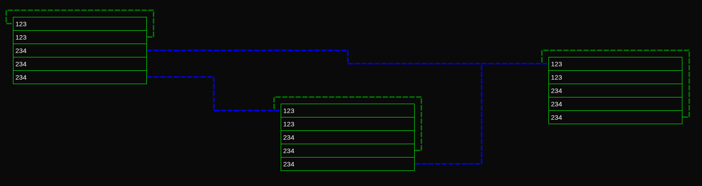

# ptvis

A web tool to visualize [page tables](https://en.wikipedia.org/wiki/Page_table),
early draft.

## Basics

Page table basics are commonly [taught in university courses and labs](
https://pdos.csail.mit.edu/6.1810/2023/labs/pgtbl.html) as well as [strategies
to handle their size](https://pages.cs.wisc.edu/~remzi/OSTEP/vm-smalltables.pdf)
and applied in the wider context of [generally managing memory](
https://cseweb.ucsd.edu/classes/su09/cse120/lectures/Lecture8.pdf).

Students learn what the entries in page tables look like, usually with a given
architecture to simplify the example, and how a memory management unit (MMU)
translates a virtual address (VA) into a physical address (PA). When page tables
are explained, it is common to omit tables not involved in the translation of
the given VA, i.e., only one table per level is drawn, since otherwise there is
not enough space. However, that may limit the understanding somewhat.

## Goal

The goal of this tool is to help understand the tables themselves and quickly
look at different architectures. The exact how is not clear at this point.
Unlike a sketch on a chalkboard, a digital approach allows for having more
context nevertheless, since the virtual canvas we draw on is infinite and we can
hide and show parts as we please, offering toggles and many other controls.

We do not want to get down do the detail of addressing a single byte, since that
is commonly a simple offset once a physical page is found and too much to show.

## Background

Page tables are tricky to organize in a way such that constructing VAs and using
the phyiscal pages becomes efficient and secure. Note that the page table setup
has implications on managing the page tables themselves, both in terms of
bookkeeping and updating them during memory allocation and process termination.
[FreeBSD has an article](https://docs.freebsd.org/en/articles/vm-design/)
explaining why the design is hard and how theirs evolved over time.

There are multiple ways to _define_ page tables, each ISA being a bit different,
possibly offering different variants (_schemes_), e.g. RISC-V's SV32, SV39, etc.

At the same time, there are different ways to _use_ page tables.
For example, the [Hypatia hypervisor proposes _recursive page tables_](
https://github.com/hypatia-hypervisor/hypatia/blob/main/docs/hdp/0015).
Linux documents its specific setups per architecture, such as [on RISC-V](
https://www.kernel.org/doc/html/v6.6/riscv/vm-layout.html) and [on x86](
https://www.kernel.org/doc/html/v6.6/arch/x86/x86_64/mm.html).

Finally, there are multiple ways to look at and thus _visualize_ page tables.

Here are some other projects looking at different aspects:

- <http://publications.alex-ionescu.com/BlackHat/BlackHat%202013%20-%20Visualizing%20Page%20Tables%20for%20Hacking%20Like%20in%20the%20Movies.pdf>
    - Presentation: <https://media.blackhat.com/us-13/US-13-Wicherski-Hacking-like-in-the-Movies-Visualizing-Page-Tables-WP.pdf>
    - Based on <https://binvis.io/> / <https://corte.si/posts/visualisation/binvis/>
    - Security view on how pages are marked RWX etc

## Development

This is a [Next.js](https://nextjs.org) project bootstrapped with
[`create-next-app`](https://nextjs.org/docs/pages/api-reference/create-next-app).

To run the development server:

```bash
npm start
```

Here is a first example screenshot:



Refer to the [Next.js documentation](https://nextjs.org/docs) for more.
